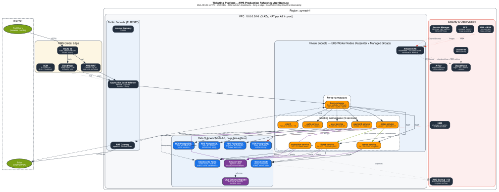
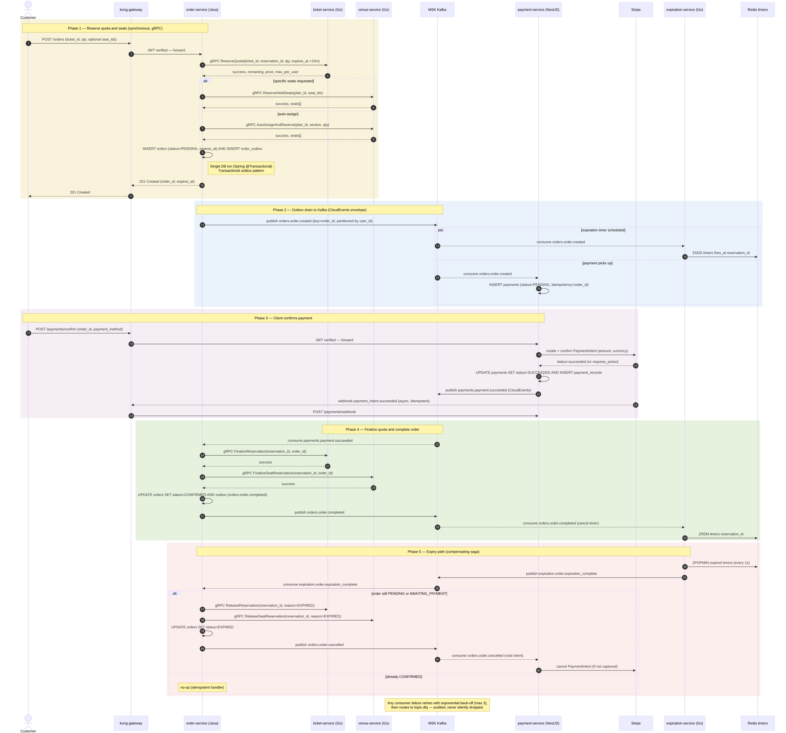
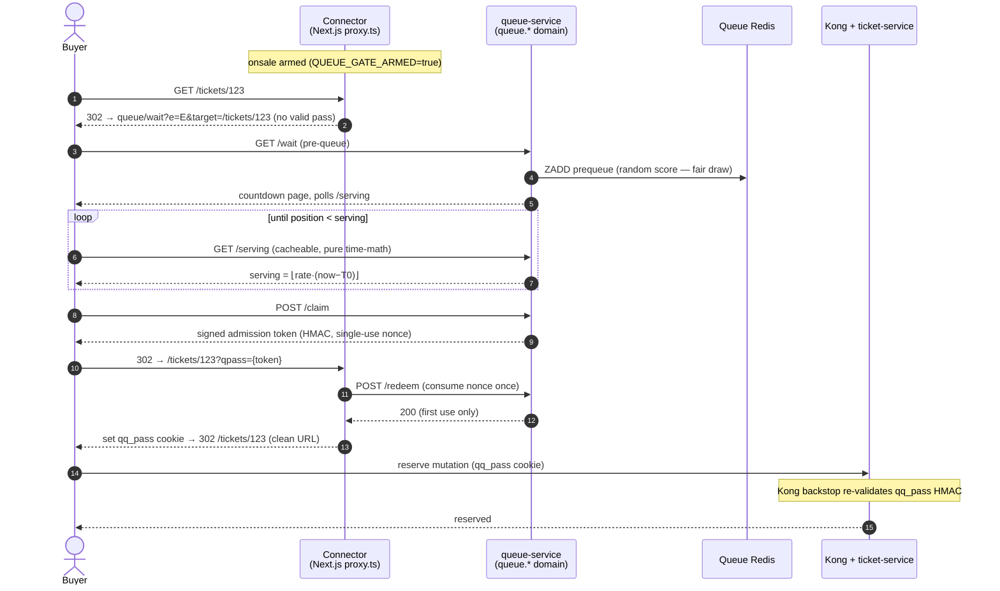

# E-Ticketing platform

> **Project inspiration:** This project re-designs the concept and domain from the Udemy course
> [Microservices with Node JS and React](https://www.udemy.com/course/microservices-with-node-js-and-react/),
> but with a completely redesigned architecture, polyglot stack, and distributed infrastructure.

> **Work in progress — practice project.**
>
> This is a deliberately over-engineered E-Commerce app built as a hands-on study of
> **polyglot microservices**, **multi-language inter-process communication**, and
> **Kubernetes infrastructure patterns** — not as a production system.

> The goal is to experience the real friction of operating multiple languages and runtimes inside a kubernetes: shared contracts, independent deployments, cost trade-offs,
> It also explores human-in-the-loop and agentic workflow patterns across tools such as
> Claude Code, OpenCode, and Copilot within a continuously iterated development workflow.
> tools and methodologies: shared contracts, independent deployments, cost trade-offs,
> and the infrastructure plumbing that holds it all together.

---

## Table of Contents

1. [Purpose](#1-purpose)
2. [Architecture](#2-architecture)
3. [Services](#3-services)
4. [Technology Decisions](#4-technology-decisions)
5. [Repository Structure](#5-repository-structure)
6. [Code Style & Conventions](#6-code-style--conventions)
7. [Operations](#7-operations)
   - [Local Development (Docker Compose)](#71-local-development-docker-compose)
   - [Local Kubernetes (minikube)](#72-local-kubernetes-minikube)
   - [Protobuf / gRPC Code Generation](#73-protobuf--grpc-code-generation)
   - [Running Tests](#74-running-tests)
8. [Status](#8-status)
9. [Roadmap & Todos](#9-roadmap--todos)

---

## 1. Purpose

### What this is

A ticketing/event marketplace where users can list tickets for sale, other users can
purchase them, and orders expire after a configurable window if payment is not received.

The domain is intentionally simple. The infrastructure is not.
Each architectural decision was chosen to mirror a real-world challenge:

| Challenge | What it forces you to confront |
|---|---|
| Four different languages/runtimes | Shared contracts via protobuf; per-language testing conventions; independent CI pipelines |
| gRPC between Go and Java | Proto3 versioning; deadline propagation; stub generation workflow |
| Kafka for event fan-out | Idempotent consumers; transactional outbox; DLQ handling; consumer group isolation |
| Kong API Gateway | Centralised JWT verification; CSRF handling behind a reverse proxy; declarative config |
| Separate DB per service | Data ownership boundaries; eventual consistency; local read replicas |
| Helm umbrella chart | Multi-service deployment; environment-specific overrides; secret injection |
| Terraform across 3 environments | Module reuse; remote state; cost-tiered resource sizing |

### What this is not

- A production system. Shortcuts are documented (stubbed Stripe, dev RSA key in compose, no CI yet).
- A showcase of business logic. The domain is a vehicle for the infrastructure patterns.
- Complete. CI/CD pipelines, EKS deployment, and AWS-managed observability are still pending.

---

## 2. Architecture

### Architecture diagrams

For the best viewing experience, open the deployed static site and see the same diagrams rendered in full size:

https://emmilcheung.github.io/k8s-multi-language-gRPC-microservice/

The embedded SVGs below are the local thumbnails from `docs/diagrams/`, but the GitHub Pages site is the recommended way to inspect the diagrams in greater detail.









> Open `docs/diagrams/index.html` for a browser-based diagram landing page.


**Request flow:**

1. Browser sends HTTPS → AWS ALB terminates TLS.
2. ALB forwards to **Kong**. Kong validates the RS256 JWT (JWKS from auth-service),
   injects `X-User-Id` header, applies rate limiting.
3. Kong routes by path prefix to the correct service.
4. Services trust the forwarded identity header — they never re-verify the token.

**Service-to-service:**

- **Synchronous:** gRPC — order-service orchestrates a multi-step saga: `ReserveQuota` +
  `ReserveHeldSeats`/`AutoAssignAndReserve` on create, `FinalizeReservation` +
  `FinalizeSeatReservation` on payment, `ReleaseReservation` + `ReleaseSeatReservation`
  on expiry (5 s deadline per call).
- **Asynchronous:** Kafka — all cross-service event fan-out (order created/cancelled,
  ticket created/updated, payment captured, expiration complete).

### Virtual waiting room (onsale surge gate)

A **separate, opt-in subsystem** (`services/queue-service`, .NET 10) that meters traffic
into the buy path during a high-demand onsale. It runs on its **own domain, own pods, and
own Redis** — isolated so a surge never competes with the platform for resources — and is
**disarmed by default** (zero effect until an onsale is armed). The read path stays fully
cached; only the scarce write path (reservation) is gated.

How a buyer flows through it when armed:



**Admission is pure calculation** — `serving(t) = ⌊rate·(t − T0)⌋` — so the hot `/serving`
endpoint does no Redis work and stays flat under load (measured: p95 **19.5 ms at 500 VUs /
~31k req/s, 0 failures**). Fairness uses a pre-queue **randomized draw** at sale start, then
FIFO; admission tokens are HMAC-signed and **single-use** (replay-proof).

**Setup:**

- **Local:** `docker compose -f docker-compose.queue.yml up` — own Redis on `:6390`, waiting
  page + API on `:4100`. Arm the client gate via env (see `services/client/.env.example`):
  `QUEUE_GATE_ARMED=true QUEUE_EVENT_ID=<id> QUEUE_URL=http://localhost:4100 QUEUE_HMAC_SECRET=<32+ chars>`.
- **Kubernetes:** standalone chart `infra/queue-system/` (own namespace + Redis, HPA, PDB,
  Ingress on the queue subdomain): `helm install queue infra/queue-system --set queue.hmacSecret=<secret>`.
- **Arm/disarm:** flip `QUEUE_GATE_ARMED` on the connector and the event config — the gate and
  the Kong reserve-mutation backstop are inert until armed.

Design, plans, and the security/reliability remediation report live under
[`docs/superpowers/specs/`](docs/superpowers/specs/) (`2026-06-16-virtual-waiting-room-design.md`,
`2026-06-17-virtual-waiting-room-hardening.md`).

---

## 3. Services

| Service | Language | Framework | Port | Database | Responsibility |
|---|---|---|---|---|---|
| **auth-service** | TypeScript / Node.js 24 | NestJS 10 | 3000 | PostgreSQL 16 | Signup · signin · signout · RS256 JWT issuance · JWKS endpoint |
| **ticket-service** | Go 1.23+ | Echo v4 | 8080 / **50051** gRPC | MongoDB 7 + OpenSearch (opt-in read model) | Ticket CRUD · Kafka producer · gRPC server · OpenSearch-backed search (CQRS read model, flag-gated) |
| **order-service** | Java 21 | Spring Boot 4 | 8080 | PostgreSQL 16 | Order lifecycle · gRPC client · transactional outbox |
| **payment-service** | TypeScript / Node.js 24 | NestJS 10 | 3000 | PostgreSQL 16 | Payment creation · Stripe (stubbed Phase 1) · Kafka |
| **expiration-service** | Go 1.23+ | — (worker) | 8080 (health) | Redis | Delayed job queue · publishes expiration events |
| **user-service** | TypeScript / Node.js 24 | NestJS 10 | 3004 | PostgreSQL 16 | Profile · preferences · billing address · GraphQL subgraph |
| **venue-service** | Go 1.23+ | Echo v4 | 3003 / **50052** gRPC | PostgreSQL 16 + Redis | Venue · seating plans · seat holds (Redis hot path) · SSE live updates · Kafka consumer |
| **client** | TypeScript | Next.js 16 | 4000 | — | App Router SSR frontend · Server Actions · shadcn/ui |
| **apollo-router** | — | Apollo Router v2.1 | 4000 | — | GraphQL Federation v2 supergraph gateway (6 subgraphs) |
| **kong-gateway** | — | Kong 3.9 | 8000 / 8443 | — (DB-less) | JWT auth · routing · rate-limiting · CSRF fix |
| **queue-service** † | C# / .NET 10 | ASP.NET Core (Razor + Minimal API) | 8080 (own subdomain) | Redis (own) | **Separate** virtual waiting room — meters onsale surge into the buy path; disarmed by default |

† Standalone subsystem, deployed **apart** from the platform (own domain, pods, and Redis; own Helm chart `infra/queue-system/`). See [Virtual waiting room](#virtual-waiting-room-onsale-surge-gate).

### Kafka event topology

```
tickets.ticket.created               ← ticket-service produces
tickets.ticket.updated               ← ticket-service produces
orders.order.created                  ← order-service produces (outbox)
orders.order.cancelled                ← order-service produces (outbox)
orders.order.completed                ← order-service produces (outbox)
payments.payment.succeeded            ← payment-service produces
expiration.order.expiration_complete  ← expiration-service produces
venue.seat.reserved                   ← venue-service produces
venue.seat.released                   ← venue-service produces
```

Every topic has a corresponding `.dlq` (dead letter queue) for failed consumer messages.

### gRPC contracts

Defined in `proto/tickets/v1/tickets.proto` (proto3).

```protobuf
service TicketService {
  rpc GetTicket                  (GetTicketRequest)              returns (GetTicketResponse);
  rpc ValidateTicketAvailability (ValidateTicketRequest)         returns (ValidateTicketResponse);
  rpc ReserveQuota               (ReserveQuotaRequest)           returns (ReserveQuotaResponse);
  rpc ReleaseReservation         (ReleaseReservationRequest)     returns (ReleaseReservationResponse);
  rpc FinalizeReservation        (FinalizeReservationRequest)    returns (FinalizeReservationResponse);
}
```

Defined in `proto/venue/v1/venue.proto` (proto3).

```protobuf
service VenueService {
  rpc ReserveHeldSeats       (ReserveHeldSeatsRequest)       returns (ReserveHeldSeatsResponse);
  rpc AutoAssignAndReserve   (AutoAssignAndReserveRequest)   returns (AutoAssignAndReserveResponse);
  rpc ReleaseSeatReservation (ReleaseSeatReservationRequest) returns (ReleaseSeatReservationResponse);
  rpc FinalizeSeatReservation(FinalizeSeatReservationRequest)returns (FinalizeSeatReservationResponse);
  rpc GetSeatingPlan         (GetSeatingPlanRequest)         returns (GetSeatingPlanResponse);
}
```

Generated stubs live in `libs/grpc-stubs/go/` (Go — ticket-service and venue-service server side).
Java (order-service) generates stubs at Maven build time via the `protobuf-maven-plugin`.

---

## 4. Technology Decisions

| Concern | Choice | Notes |
|---|---|---|
| **Messaging** | Apache Kafka (KRaft, no ZooKeeper) | Durable, replayable fan-out. Replaces deprecated NATS Streaming from the legacy system. Phase 1: Strimzi in-cluster; Phase 2: AWS MSK. |
| **API Gateway** | Kong 3.9 (DB-less declarative) | Centralised JWT, rate-limiting, correlation ID. No click-ops — config is a YAML file rendered by a build script. |
| **JWT** | RS256 asymmetric | Private key stays in auth-service / Secrets Manager. Public key distributed via JWKS — Kong never holds the signing key. |
| **Inter-service sync** | gRPC (proto3) | Type-safe binary contracts. Used only where an immediate response is required (order validation). REST is never used between internal services. |
| **Auth/Payments DB** | PostgreSQL 16 (RDS) | ACID guarantees required for user records and financial data. Flyway / Drizzle migrations; UUID PKs throughout. |
| **Tickets DB** | MongoDB 7 | Flexible document model; high read throughput; OCC via `version` field. |
| **Expiration store** | Redis 7 (ElastiCache) | `asynq` delayed job queue; also used by Kong rate-limit plugin. |
| **Container registry** | Amazon ECR | One repo per service; image tag = Git SHA (never `latest`) in non-local environments. |
| **IaC** | Terraform | EKS, VPC, RDS ×3, ElastiCache, MSK (Phase 2), ECR, IAM, Secrets Manager. Remote state: S3 + DynamoDB lock. |
| **Secrets** | AWS Secrets Manager + External Secrets Operator | Never committed to Git. ESO syncs to K8s Secrets at pod startup. IRSA per service for least-privilege. |
| **Observability** | OTel Collector → AMP + AMG + AWS X-Ray | Fully managed — no self-hosted Prometheus/Grafana pods. Deferred to Milestone 7. |
| **Stripe** | Phase 1 stubbed · Phase 2 Payment Intents | Phase 1 always succeeds to keep scope tight. Real Stripe integration (Elements + webhooks) is Phase 2. |
| **Cost consideration** | Phase 1 Strimzi (free) → Phase 2 MSK | Kafka on EKS costs ~$0 extra vs MSK ~$200/mo. Config is written to be MSK-compatible so migration is a broker URL swap. MongoDB self-hosted on EKS rather than Atlas for the same reason. |
| **Search** | OpenSearch (self-hosted, Apache-2.0) | CQRS read model fed by Kafka — ticket-service search-indexer upserts a slim doc on every ticket create/update. Flag-gated via `SEARCH_BACKEND` (default `mongo`; set `opensearch` to enable); falls back to Mongo regex on outage. Same engine planned for logs (EFK) later. |

---

## 5. Repository Structure

```
/
├── services/
│   ├── auth-service/           TypeScript · NestJS · PostgreSQL
│   ├── ticket-service/         Go · Echo · MongoDB · gRPC server · OpenSearch search indexer
│   │   ├── internal/search/    client, indexer, query, reindex (CQRS read model)
│   │   └── cmd/reindex/        backfill CLI — upserts all tickets into OpenSearch
│   ├── order-service/          Java · Spring Boot · PostgreSQL · gRPC client
│   ├── payment-service/        TypeScript · NestJS · PostgreSQL
│   ├── expiration-service/     Go worker · Redis · Kafka
│   ├── user-service/           TypeScript · NestJS · PostgreSQL · profile/prefs/billing
│   ├── venue-service/          Go · Echo · PostgreSQL + Redis · gRPC server · Kafka consumer
│   ├── client/                 Next.js 16 App Router
│   ├── apollo-router/          Apollo Router v2.1 — GraphQL Federation supergraph
│   └── kong-gateway/
│       ├── config/kong.base.yml    declarative Kong config (template)
│       ├── values/minikube.yml     per-env variable overrides
│       └── scripts/build.sh        renders kong.yml from template + env values
│
├── proto/
│   ├── tickets/v1/tickets.proto   gRPC contract — ticket quota lifecycle
│   └── venue/v1/venue.proto       gRPC contract — seat reservation lifecycle
│
├── libs/
│   └── grpc-stubs/go/             generated Go stubs (committed; regenerate with buf generate)
│
├── infra/
│   ├── helm/                       umbrella Helm chart
│   │   ├── Chart.yaml              declares all sub-chart dependencies
│   │   ├── values.yaml             production defaults
│   │   ├── values-local.yaml       minikube overrides (1 replica, small resources)
│   │   ├── charts/cp-kafka/        custom Confluent cp-kafka sub-chart
│   │   └── charts/opensearch/      opt-in OpenSearch subchart (StatefulSet + PVC; plugin-off + NetworkPolicy)
│   ├── local/
│   │   ├── Makefile                day-to-day minikube commands (make up, make deploy, …)
│   │   ├── setup.sh                idempotent 7-step bootstrap script
│   │   └── secrets.env.example     template — copy to secrets.env and fill in
│   └── terraform/
│       ├── modules/{vpc,eks,rds,elasticache,msk,kong}/
│       └── environments/{dev,staging,prod}/
│
├── packages/
│   └── ticketing-mcp-server/       MCP server for agentic ticketing workflows
├── buf.yaml                        buf lint + breaking-change config
├── buf.gen.yaml                    code generation config (buf generate)
├── docker-compose.yml              all services + infra for local dev (no K8s)
├── AGENTS.md                       engineering standards + agent workflow rules
├── PLAN.md                         full architecture plan and decision log
└── STATUS.md                       build status and milestone tracker
```

---

## 6. Code Style & Conventions

Engineering standards live in [`AGENTS.md`](AGENTS.md), which indexes the standards in [`docs/01-*.md` through `docs/14-*.md`](docs/). Agents load these on demand; humans should browse the index to find what they need.

---

## 7. Operations

### Agent-driven MCP Operations

This workspace includes a local ticketing MCP server in `packages/ticketing-mcp-server` plus an agent-side client config in `.claude/mcp.json`.

This MCP setup allows Claude Code and other MCP-compatible agents to call ticketing workflows directly over stdio, using OAuth2 Authorization Code + PKCE for secure authentication and forwarding requests through Kong at `http://localhost:8000`.

See `packages/ticketing-mcp-server/README.md` for package structure, install steps, demo screenshots, and local test guidance.

The server runs locally, authenticates with OAuth2 Authorization Code + PKCE, and exposes ticketing tools to MCP-compatible agents such as Claude Code over stdio. Requests are forwarded through Kong at `http://localhost:8000` using the authenticated user's tokens.

Key points:
- MCP server package: `packages/ticketing-mcp-server`
- Agent-side config: `.claude/mcp.json`
- Claude Code discovers the config automatically when the workspace is opened.
- Auth tokens are stored securely in `~/.config/ticketing-mcp/tokens.json`.
- Tools include event search, seat availability, order creation/cancellation, payment processing, and session revocation.

Install and run the MCP server locally:
```bash
cd packages/ticketing-mcp-server
pnpm install
pnpm build
export TICKETING_API_URL=http://localhost:8000
pnpm dev
```

Test the MCP workflow:
```bash
# terminal 1
cd packages/ticketing-mcp-server
pnpm install
pnpm build
export TICKETING_API_URL=http://localhost:8000
pnpm dev

# terminal 2
cd services/auth-service
pnpm test
pnpm test:integration
```

Agent prompt guidance:
- Use exact working directories and explicit commands.
- Be specific: `run unit tests`, `build the MCP server`, `invoke search_events`, `create_order`.
- Example: `change directory into packages/ticketing-mcp-server and start the MCP server`
- Example: `change directory into services/auth-service and run pnpm test and pnpm test:integration`
- Example: `once the MCP server is running, use the agent to call search_events and list_my_orders`

The MCP tools map directly to ticketing functionality such as `search_events`, `get_event`, `view_seat_availability`, `list_my_orders`, `get_order`, `create_order`, `create_seated_order`, `cancel_order`, `get_payment`, and `pay_for_order`.

### 7.1 Local Development (Docker Compose)

The fastest way to run everything — no Kubernetes required.

```bash
# Start all services and infrastructure
docker compose up --build --detach

# Tail logs for all services
docker compose logs -f

# Stop the stack
docker compose down
```

**Service ports:**

| Service | Port |
|---|---|
| auth-service | 3000 |
| ticket-service | 3001 |
| payment-service | 3002 |
| venue-service | 3003 |
| user-service | 3004 |
| order-service | 8082 |
| Kong (API gateway) | **8000** |
| Kafka (host access for E2E) | 9093 |
| MongoDB | 27017 |
| PostgreSQL (auth) | 5432 |
| PostgreSQL (orders) | 5433 |
| PostgreSQL (payments) | 5434 |
| PostgreSQL (venue) | 5435 |
| PostgreSQL (users) | 5436 |
| Redis | 6379 |
| Schema Registry | 8081 |
| **OpenSearch** (opt-in, `--profile search`) | **9200** |
| Prometheus (separate observability compose) | 9090 |
| Jaeger (separate observability compose) | 16686 |
| Grafana (separate observability compose) | 3004 |
| OTel Collector (gRPC, separate observability compose) | 4317 |
| OTel Collector (HTTP, separate observability compose) | 4318 |

#### Enable indexed search (OpenSearch)

Start the single-node OpenSearch container (adds it to the compose network on `:9200`):

```bash
docker compose --profile search up -d opensearch
```

Set the following env vars on ticket-service (see `.env.example` for the entries):

```
SEARCH_BACKEND=opensearch
OPENSEARCH_URL=http://opensearch:9200
OPENSEARCH_INDEX=tickets
```

The search-indexer starts automatically and creates the index + begins consuming Kafka `tickets.ticket.{created,updated}`. Backfill existing tickets:

```bash
cd services/ticket-service
go run ./cmd/reindex
# requires OPENSEARCH_URL and MONGO_URI to be set; or use the gated Helm reindex Job
```

If OpenSearch is down or `SEARCH_BACKEND` is unset, search degrades automatically to the Mongo regex path — the service never hard-fails.

All traffic from the browser goes through Kong on port **8000**.

To run E2E locally:

```bash
cd services/client
pnpm dev --port 4000
```

In a second terminal:

```bash
pnpm exec playwright test
```

If you want to execute a command inside a running service container:

```bash
docker compose exec auth-service pnpm test
```

#### Fresh environment verification

Use this flow to verify the settings release on a clean machine or clean volumes. No manual SQL should be required.

```bash
# 1. Clean volumes and start the stack
docker compose down -v
docker compose up --build --detach

# 2. Confirm the settings dependencies are ready
curl -fsS http://localhost:3002/healthz/ready
curl -fsS http://localhost:3004/healthz/ready

# 3. Run only the settings E2E subset
cd services/client
pnpm exec playwright test tests/e2e/ticketing.spec.ts --grep settings
```

Service-level verification commands for the current settings hardening gate:

```bash
cd services/payment-service
pnpm test
pnpm lint
pnpm exec tsc --noEmit
pnpm build
pnpm test:integration -- test/payments.integration.spec.ts

cd ../user-service
pnpm test
pnpm test:integration
pnpm lint
pnpm exec tsc --noEmit
pnpm build

cd ../client
pnpm lint
pnpm exec tsc --noEmit
pnpm build
```

#### Local observability

The local observability stack for traces and metrics runs from `observability/local/docker-compose.observability.yml`:

- OpenTelemetry Collector receives OTLP traces from the services.
- Jaeger stores and visualizes trace spans.
- Prometheus scrapes `/metrics` and `/actuator/prometheus` endpoints.
- Grafana provisions a starter dashboard from the repository.

See [observability/local/README.md](observability/local/README.md) for the
trace walkthrough, connectivity checks, and host-run client instructions.

---

### 7.2 Local Kubernetes (minikube)

#### First-time setup

```bash
# 1. Install prerequisites: minikube, helm, kubectl, docker

# 2. Generate an RSA key pair for local dev
openssl genpkey -algorithm RSA -pkeyopt rsa_keygen_bits:4096 \
  -out infra/local/rsa_local.pem

# 3. Create and fill in secrets.env
cp infra/local/secrets.env.example infra/local/secrets.env
# Edit secrets.env — paste RSA_PRIVATE_KEY (single-line \n format) and STRIPE_SECRET_KEY

# 4. Bootstrap everything
make -C infra/local up
```

`make up` does in order:
1. Checks required tools are installed
2. Starts minikube (`--cpus=4 --memory=7168 --driver=docker`)
3. Pulls and loads Bitnami / Kong / Kafka images into minikube's image store
   _(Bitnami doesn't publish pinned tags on Docker Hub — images are pulled as `:latest`,
   retagged to the exact version the Helm chart expects, then loaded locally)_
4. Builds all 7 service images and loads them into minikube
5. Creates the `ticketing` namespace + Linkerd skip-port annotation
6. Creates all Kubernetes secrets from `secrets.env`
7. Runs `helm upgrade --install` with the umbrella chart

#### Day-to-day commands

```bash
make -C infra/local help          # list all targets

make -C infra/local deploy        # re-apply secrets + kong config + helm (no image rebuild)
make -C infra/local build         # rebuild + reload all service images
make -C infra/local helm-upgrade  # helm upgrade only (fastest after a config change)
make -C infra/local kong-config   # re-render kong.yml from kong.base.yml template

make -C infra/local tunnel        # expose Kong (8000) and Kafka (9093) on localhost
                                  # keep this running in a separate terminal

make -C infra/local status        # kubectl get pods -n ticketing
make -C infra/local logs SVC=auth-service    # tail logs for a service
make -C infra/local restart SVC=client       # rolling restart a deployment

make -C infra/local down          # uninstall Helm release + delete namespace
make -C infra/local clean         # down + stop minikube
```

#### Incremental rebuild (single service)

```bash
docker build -t auth-service:latest services/auth-service/ --quiet
minikube image load auth-service:latest
make -C infra/local restart SVC=auth-service
```

#### In-cluster service DNS (namespace: `ticketing`)

| Resource | Hostname |
|---|---|
| PostgreSQL (auth) | `ticketing-postgres-auth:5432` |
| PostgreSQL (orders) | `ticketing-postgres-orders:5432` |
| PostgreSQL (payments) | `ticketing-postgres-payments:5432` |
| PostgreSQL (venue) | `ticketing-postgres-venue:5432` |
| MongoDB | `ticketing-mongodb:27017` |
| Redis | `ticketing-redis-master:6379` |
| Kafka (internal) | `ticketing-cp-kafka:9092` |
| Kong proxy | `localhost:8000` (via `minikube tunnel`) |

---

### 7.3 Protobuf / gRPC Code Generation

The proto source of truth lives in `proto/tickets/v1/tickets.proto`.
Generated stubs are committed to `libs/grpc-stubs/` so services don't need `buf` installed at runtime.

#### Prerequisites (install once)

```bash
brew install bufbuild/buf/buf
go install google.golang.org/protobuf/cmd/protoc-gen-go@latest
go install google.golang.org/grpc/cmd/protoc-gen-go-grpc@latest
```

#### Regenerate stubs after a `.proto` change

```bash
buf generate
```

Output lands in `libs/grpc-stubs/go/` — commit the result alongside the `.proto` change.

Java stubs (order-service) are generated automatically by the `protobuf-maven-plugin`
during `mvn package` — no manual step required.

#### Lint and breaking-change check

```bash
buf lint                    # lint proto files
buf breaking --against .git  # check for breaking changes vs HEAD
```

Breaking changes (removing a field, renaming a field, changing a field number) must
never be introduced without a version bump (`v1` → `v2` package and directory).
CI will enforce this with `buf breaking` on every PR (once pipelines are written).

#### Modifying the contract

1. Edit `proto/tickets/v1/tickets.proto`.
2. Run `buf lint` — fix any style violations.
3. Run `buf breaking --against .git` — confirm no breaking changes (or bump the version).
4. Run `buf generate` — regenerate Go stubs.
5. Update the service implementations on both the server (ticket-service) and client (order-service).
6. Commit the `.proto` file, generated stubs, and service changes together in one PR.

---

### 7.4 Running Tests

#### auth-service (TypeScript / Vitest)

```bash
cd services/auth-service
pnpm test           # unit tests (no external deps)
pnpm test:integration  # integration tests (Testcontainers spins up PostgreSQL)
```

#### ticket-service (Go / testify + testcontainers-go)

```bash
cd services/ticket-service
go test ./...                          # unit tests
go test ./... -tags integration        # integration tests (requires Docker)
```

#### order-service (Java / JUnit 5 + Testcontainers)

```bash
cd services/order-service
mvn test                              # unit tests
mvn verify -P integration-test        # integration tests (requires Docker)
```

#### payment-service (TypeScript / Vitest)

```bash
cd services/payment-service
pnpm test
pnpm test:integration
```

#### E2E (Playwright — runs against Docker Compose or minikube)

```bash
# Against Docker Compose:
docker compose up --build --detach
cd services/client
pnpm dev --port 4000
```

In a second terminal:

```bash
pnpm exec playwright test
```

#### Against minikube (requires 'make -C infra/local tunnel' running):

```bash
cd services/client
pnpm exec playwright test
```

---

## 8. Status

> **Overall: ~75% complete.** All services built and E2E tested. EKS and CI/CD are pending.

| Component | Status | Notes |
|---|---|---|
| auth-service | ✅ Complete | 28 tests passing |
| ticket-service | ✅ Complete | 29 tests passing |
| order-service | ✅ Complete | Flyway, gRPC client, outbox pattern |
| payment-service | ✅ Complete | 25 tests passing; Stripe stubbed |
| expiration-service | ✅ Complete | asynq + Redis + Kafka |
| venue-service | ✅ Complete | Go/Echo; seat inventory; gRPC server (port 50052); Kafka consumer |
| client (Next.js) | ✅ Complete | All pages, Server Actions |
| Kong API Gateway | ✅ Complete | RS256 JWT; CSRF fix for Server Actions behind proxy |
| E2E Playwright tests | ✅ 18/18 passing | Auth, tickets, orders, payment |
| Docker Compose (local dev) | ✅ Running | `docker compose up --build` |
| Local Kubernetes (minikube) | ✅ Running | `make -C infra/local up`; 13/13 pods Running |
| Helm umbrella chart | ✅ Complete | Bitnami sub-charts + custom cp-kafka + venue-service subchart |
| Indexed search (OpenSearch CQRS read model) | ✅ Complete | Flag-gated (`SEARCH_BACKEND=opensearch`); Kafka-fed indexer; Mongo-regex fallback; opt-in Helm subchart |
| Terraform modules | ✅ Scaffolded | vpc, eks, rds, elasticache, msk, kong; **not applied to real AWS** |
| CI/CD pipelines | ⏳ Pending | `.github/workflows/` is empty |
| EKS deployment | ⏳ Pending | Terraform apply deferred; local minikube is the active env |
| Observability (local compose) | ✅ Available | OTel Collector + Prometheus + Jaeger + Grafana |
| Observability (AWS-managed) | ⏳ Pending | AMP / AMG / X-Ray wiring still deferred |

### Known shortcuts and tech debt

| Item | Severity | Detail |
|---|---|---|
| RSA private key in `docker-compose.yml` | Medium | Dev-only convenience; must move to a gitignored `.env` before any CI or shared use |
| Stripe stubbed | Low | Phase 1 always returns success; real Payment Intents are Phase 2 |
| Kafka disabled locally in K8s | Low | `bitnami/kafka` has no Docker Hub tags; replaced by custom `cp-kafka` sub-chart; services log broker errors on startup (acceptable for local dev) |
| No CI pipelines | Medium | Manual testing only; `.github/workflows/` intentionally left empty until Milestone 8 |

---

## 9. Roadmap & Todos

### Milestone 7 — Observability & hardening
- [ ] Fluent Bit DaemonSet → CloudWatch Logs
- [ ] OTel Collector sidecar → AMP (metrics) + AWS X-Ray (traces)
- [ ] Amazon Managed Grafana dashboards (RED method per service, Kafka consumer lag)
- [ ] Dead letter queue handlers fully wired in all consumers
- [ ] HPA + PDB for all services
- [ ] NetworkPolicy enforcement (restrict ingress/egress per service)
- [ ] `trivy` image scan on every build
- [ ] Resource requests/limits reviewed and tuned

### Milestone 8 — CI/CD pipelines
- [ ] Per-service GitHub Actions workflows: lint → unit test → integration test → build → scan → push to ECR
- [ ] `ci-proto.yaml`: buf lint + breaking check + stub regeneration on `.proto` change
- [ ] `ci-terraform.yaml`: `fmt` + `validate` + `plan` on PR; `apply` on merge to `main`
- [ ] GitHub OIDC → IAM role assumption (no long-lived AWS keys in secrets)
- [ ] Image tag = Git SHA; push to ECR; Helm chart updated automatically

### Milestone 9 — EKS deployment & staging
- [ ] `infra/scripts/bootstrap-state.sh` — provision S3 bucket + DynamoDB table for remote Terraform state
- [ ] `terraform apply` for dev environment (VPC, EKS, RDS ×3, ElastiCache, Strimzi/MSK, Kong)
- [ ] Deploy all services to EKS dev via Helm; smoke test with the Playwright suite
- [ ] Staging environment provisioned and E2E tested
- [ ] Runbook: production deploy gate, rollback procedure, secret rotation

### Phase 2 — Stripe Payment Intents
- [ ] Replace stubbed payment with real Stripe Payment Intents + Stripe Elements frontend
- [ ] Stripe webhook handler with signature verification
- [ ] `POST /api/payments/create-payment-intent` → returns `clientSecret` to client

### Future / adaptive
- [ ] Service mesh (Linkerd) installed in cluster — mTLS between all pods (namespace annotation placeholders already in place)
- [ ] AWS MSK migration — swap Strimzi broker URL; no application code changes required
- [ ] Schema Registry enforcement — Avro schemas registered and validated on every produce
- [ ] Multi-region (ap-southeast-1 primary; us-east-1 replica) if traffic warrants it
- [ ] `expiration-service` unit + integration tests (currently no test suite)
- [ ] Contract tests (Pact) for the gRPC and REST boundaries between services
