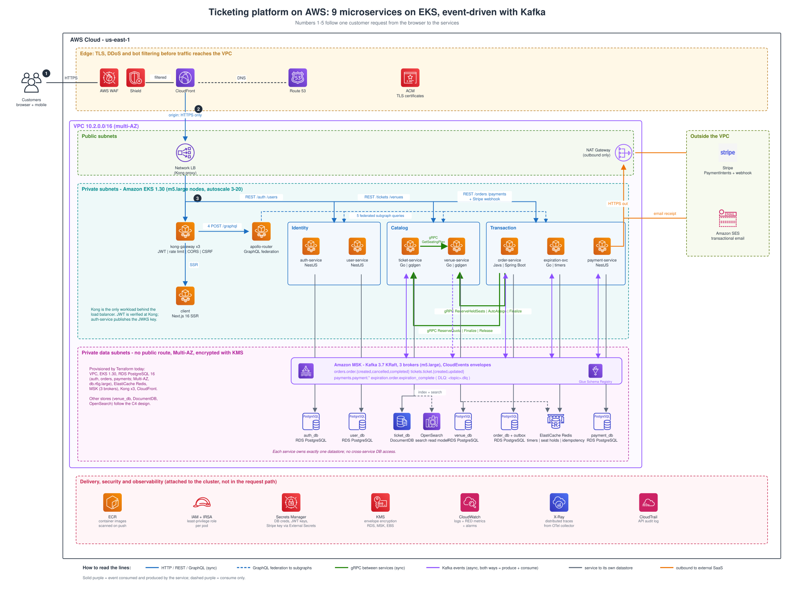
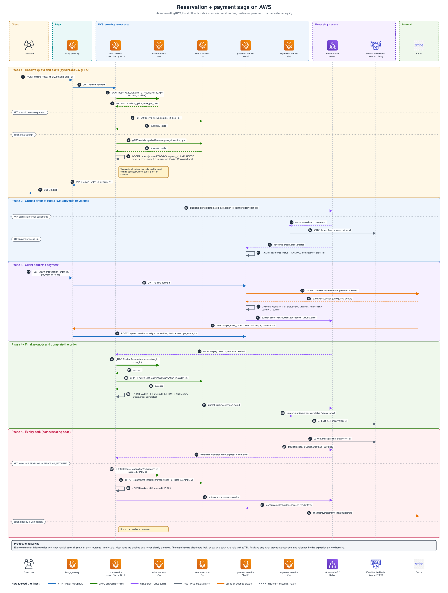
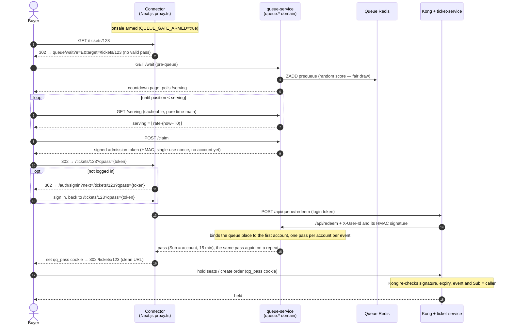

# E-Ticketing Platform

[](https://github.com/emmilcheung/k8s-multi-language-gRPC-microservice/actions/workflows/ci.yml)
[](LICENSE)

An event-ticketing marketplace built as a **polyglot microservices** system: Go, Java, TypeScript and C# services talking over gRPC and Kafka, behind a Kong gateway, deployed with Helm and Terraform. It also exposes the platform to AI agents through an [MCP](https://modelcontextprotocol.io) server with OAuth 2.1.

> **Practice project, not a production system.** The domain is deliberately simple; the infrastructure is the point. It is a hands-on study of running several languages and runtimes on Kubernetes: shared contracts, independent deployments, cost trade-offs, and an agent-assisted development workflow. It re-designs the domain of the Udemy course [Microservices with Node JS and React](https://www.udemy.com/course/microservices-with-node-js-and-react/) with a completely different architecture.

## Features

- **Ticketing:** events, ticket types with quotas, venues and seating plans, seat holds, orders that expire if unpaid, Stripe payments, QR-based attendance check-in.
- **Order saga:** order-service coordinates ticket-service and venue-service over gRPC (reserve, finalize, release) and reacts to payment and expiration events from Kafka, using a transactional outbox.
- **Edge security:** Kong verifies RS256 JWTs (JWKS from auth-service), enforces OAuth scopes, rate limits and CSRF handling.
- **Search:** OpenSearch read model fed by Kafka (CQRS), with automatic fallback to MongoDB.
- **GraphQL:** Apollo Router federates the subgraphs for the web client.
- **Virtual waiting room:** a separate .NET service that meters onsale surges into the buy path.
- **AI agents (MCP):** an OAuth 2.1 resource server gives agents such as Claude Code twelve scoped, revocable ticketing tools. See [`services/mcp-service`](services/mcp-service/README.md).
- **Operations:** Docker Compose and minikube for local work, Helm umbrella chart, Terraform modules, OpenTelemetry traces and metrics, k6 load tests, Trivy-gated CI.

## Quick start

```bash
cp .env.example .env              # set RSA_PRIVATE_KEY and STRIPE_SECRET_KEY (or STRIPE_SECRET_KEY=test_mock)
docker compose up --build --detach
```

Everything the browser talks to goes through Kong at **http://localhost:8000**. See [Local development](#local-development) for the web client, Kubernetes, protobuf and tests.

To connect an AI agent: `docker compose --profile mcp up -d --build`, then `claude mcp add --transport http ticketing http://localhost:8000/mcp` ([MCP guide](docs/ticketing/mcp.md)).

## Architecture



All diagrams (infrastructure, data model, reservation and payment saga, auth flows, waiting room, search) are generated from source in [`docs/diagrams/`](docs/diagrams/) and published at https://emmilcheung.github.io/k8s-multi-language-gRPC-microservice/.



**Request flow**

1. The browser sends HTTPS to the load balancer, which forwards to **Kong**.
2. Kong validates the RS256 JWT, injects the `X-User-Id` header, applies rate limiting and routes by path prefix.
3. Services trust the forwarded identity header; they never re-verify the token.

**Service-to-service**

- **Synchronous (gRPC):** order-service runs a multi-step saga: `ReserveQuota` plus `ReserveHeldSeats` / `AutoAssignAndReserve` on create, `FinalizeReservation` plus `FinalizeSeatReservation` on payment, `ReleaseReservation` plus `ReleaseSeatReservation` on expiry (5 s deadline per call). Contracts: [`proto/tickets/v1`](proto/tickets/v1/tickets.proto) and [`proto/venue/v1`](proto/venue/v1/venue.proto).
- **Asynchronous (Kafka):** all cross-service event fan-out, with a dead-letter topic (`.dlq`) per consumed topic.

| Topic | Producer |
|---|---|
| `tickets.ticket.created`, `tickets.ticket.updated` | ticket-service |
| `orders.order.created`, `orders.order.cancelled`, `orders.order.completed` | order-service (outbox) |
| `payments.payment.initiated`, `payments.payment.captured`, `payments.payment.failed` | payment-service (outbox) |
| `expiration.order.expiration_complete` | expiration-service |

### Virtual waiting room (onsale surge gate)

A **separate, opt-in subsystem** (`services/queue-service`, .NET 10) that meters traffic
into the buy path during a high-demand onsale. It runs on its **own domain, own pods, and
own Redis** — isolated so a surge never competes with the platform for resources — and is
**disarmed by default** (zero effect until an onsale is armed). The read path stays fully
cached; only the purchase writes (holding seats and creating an order, over GraphQL or REST)
are gated. Paying for and releasing a hold never are, so a pass that expires mid-checkout
does not strand a buyer.

How a buyer flows through it when armed:


```mermaid
sequenceDiagram
    autonumber
    actor B as Buyer
    participant C as Connector<br/>(Next.js proxy.ts)
    participant Q as queue-service<br/>(queue.* domain)
    participant R as Queue Redis
    participant K as Kong + ticket-service

    Note over C: onsale armed (QUEUE_GATE_ARMED=true)
    B->>C: GET /tickets/123
    C-->>B: 302 → queue/wait?e=E&target=/tickets/123  (no valid pass)
    B->>Q: GET /wait  (pre-queue)
    Q->>R: ZADD prequeue (random score — fair draw)
    Q-->>B: countdown page, polls /serving
    loop until position < serving
        B->>Q: GET /serving   (cacheable, pure time-math)
        Q-->>B: serving = ⌊rate·(now−T0)⌋
    end
    B->>Q: POST /claim
    Q-->>B: signed admission token (HMAC, single-use nonce, no account yet)
    B->>C: 302 → /tickets/123?qpass={token}
    opt not logged in
        C-->>B: 302 → /auth/signin?next=/tickets/123?qpass={token}
        B->>C: sign in, back to /tickets/123?qpass={token}
    end
    C->>K: POST /api/queue/redeem (login token)
    K->>Q: /api/redeem + X-User-Id and its HMAC signature
    Note over Q: binds the queue place to the first account, one pass per account per event
    Q-->>C: pass (Sub = account, 15 min), the same pass again on a repeat
    C-->>B: set qq_pass cookie → 302 /tickets/123 (clean URL)
    B->>K: hold seats / create order (qq_pass cookie)
    Note over K: Kong re-checks signature, expiry, event and Sub = caller
    K-->>B: held
```

**Admission is pure calculation** — `serving(t) = ⌊rate·(t − T0)⌋` — so the hot `/serving`
endpoint does no Redis work and stays flat under load (measured: p95 **19.5 ms at 500 VUs /
~31k req/s, 0 failures**). Fairness uses a pre-queue **randomized draw** at sale start, then
FIFO; admission tokens are HMAC-signed and **single-use** (replay-proof). Redeeming one
needs a login and binds the place to that account: one pass per account per event, valid
15 minutes, which Kong refuses for anyone else, so a pass cannot be resold or shared.

**Setup:**

- **Local:** `docker compose -f docker-compose.queue.yml up` — own Redis on `:6390`, waiting
  page + API on `:4100`. Arm the client gate via env (see `services/client/.env.example`):
  `QUEUE_GATE_ARMED=true QUEUE_EVENT_ID=<id> QUEUE_URL=http://localhost:4100 QUEUE_HMAC_SECRET=<32+ chars>`.
  The compose file needs `X_USER_ID_SIGNING_KEY` in `.env` (the key Kong signs `X-User-Id` with).
- **Kubernetes:** standalone chart `infra/queue-system/` (own namespace + Redis, HPA, PDB,
  Ingress on the queue subdomain): `helm install queue infra/queue-system -n queue --create-namespace --set image.tag=<tag> --set queue.hmacSecret=<secret> --set queue.userIdSigningKey=<Kong's KONG_SIGNING_KEY>`.
  Kong reaches it at `queue-service.queue.svc.cluster.local` (`HOST_QUEUE`).
- **Arm/disarm:** flip `QUEUE_GATE_ARMED` on the connector and on Kong (with `QUEUE_EVENT_ID`,
  `QUEUE_HMAC_SECRET` and `KONG_SIGNING_KEY` set), plus the event config. The gate and the
  Kong purchase backstop are inert until armed.

Design, plans, and the security/reliability remediation report live under
[`docs/superpowers/specs/`](docs/superpowers/specs/) (`2026-06-16-virtual-waiting-room-design.md`,
`2026-06-17-virtual-waiting-room-hardening.md`).

---

## Services

| Service | Stack | Host port | Data | Responsibility |
|---|---|---|---|---|
| [auth-service](services/auth-service/README.md) | TypeScript · NestJS 11 | 3000 | PostgreSQL | Sign-up and sign-in, RS256 JWTs and JWKS, OAuth 2.1 authorization server (PKCE, consent, token exchange, dynamic client registration, client metadata documents) |
| [ticket-service](services/ticket-service/README.md) | Go · Echo | 3001 (gRPC 50051) | MongoDB, OpenSearch | Tickets and quotas, gRPC server, search indexer |
| [order-service](services/order-service/README.md) | Java 21 · Spring Boot 4 | 8082 | PostgreSQL | Order lifecycle, saga orchestration, transactional outbox |
| [payment-service](services/payment-service/README.md) | TypeScript · NestJS 11 | 3002 | PostgreSQL | Stripe PaymentIntents, webhooks, outbox |
| [expiration-service](services/expiration-service/README.md) | Go worker | 8083 | Redis | Delayed jobs that expire unpaid orders |
| [venue-service](services/venue-service) | Go · Echo | 3003 (gRPC 50052) | PostgreSQL, Redis | Venues, seating plans, seat holds, live seat updates |
| [user-service](services/user-service/README.md) | TypeScript · NestJS 11 | 3004 | PostgreSQL | Profile, preferences, billing, saved payment methods |
| [attendance-service](services/attendance-service/README.md) | Go | 3007 | PostgreSQL | QR admission credentials and scan check-in |
| [mcp-service](services/mcp-service/README.md) | TypeScript · MCP SDK | 3010 (opt-in) | none | MCP resource server: agent tools over OAuth 2.1 |
| [client](services/client/README.md) | Next.js 16 | 4000 | none | App Router web app with Server Actions |
| [apollo-router](services/apollo-router) | Apollo Router | 4001 | none | GraphQL Federation supergraph |
| [kong-gateway](services/kong-gateway/README.md) | Kong (DB-less) | 8000 | none | JWT and scope enforcement, routing, rate limiting |
| [queue-service](services/queue-service) † | C# · .NET 10 | 4100 | Redis (own) | Virtual waiting room, deployed separately |

† Standalone subsystem with its own domain, pods and Redis; see below.


## Local development

Full reference, including every port, fresh-environment checks and troubleshooting: [`docs/development.md`](docs/development.md).

### Docker Compose

```bash
docker compose up --build --detach     # all services and infrastructure
docker compose logs -f                 # tail logs
docker compose down                    # stop (add -v to drop volumes)
```

| Service | Host port | | Service | Host port |
|---|---|---|---|---|
| **Kong (all browser traffic)** | **8000** | | venue-service | 3003 |
| auth-service | 3000 | | user-service | 3004 |
| ticket-service | 3001 | | attendance-service | 3007 |
| payment-service | 3002 | | order-service | 8082 |
| mcp-service (`--profile mcp`) | 3010 | | OpenSearch (`--profile search`) | 9200 |

Opt-in profiles: `mcp` (MCP server), `search` (OpenSearch; also set `SEARCH_BACKEND=opensearch` on ticket-service, backfill with `go run ./cmd/reindex` in `services/ticket-service`). Traces and metrics run from a separate Compose file; see [`observability/local/README.md`](observability/local/README.md). The waiting room has its own: `docker compose -f docker-compose.queue.yml up`.

### Local Kubernetes (minikube)

```bash
openssl genpkey -algorithm RSA -pkeyopt rsa_keygen_bits:4096 -out infra/local/rsa_local.pem
cp infra/local/secrets.env.example infra/local/secrets.env    # fill in RSA_PRIVATE_KEY, STRIPE_SECRET_KEY
make -C infra/local up        # start minikube, build and load images, create secrets, helm install
make -C infra/local tunnel    # expose Kong (8000) and Kafka (9093); keep running in another terminal
```

Day to day: `make -C infra/local help` lists targets; the common ones are `deploy` (re-apply config and Helm, no rebuild), `build` (rebuild images), `status`, `logs SVC=<name>`, `restart SVC=<name>`, `down` and `clean`.

### Protobuf / gRPC

Contracts live in `proto/`; generated Go stubs are committed in `libs/grpc-stubs/go/` (Java stubs are generated by Maven).

```bash
brew install bufbuild/buf/buf
buf lint && buf breaking --against .git    # style and breaking-change checks (also run in CI)
buf generate                               # regenerate stubs; commit them with the .proto change
```

Never make a breaking change (removing or renumbering a field) without a new version package (`v1` → `v2`).

### Tests

| Service | Unit | Integration (needs Docker) |
|---|---|---|
| NestJS services (auth, payment, user) | `pnpm test` | `pnpm test:integration` |
| mcp-service | `pnpm test` | none (covered by the Playwright E2E spec) |
| ticket-service (Go) | `go test ./...` | `go test ./... -tags integration` |
| venue-service (Go) | `go test ./...` | none tagged |
| order-service (Java) | `mvn test` | `mvn verify -P integration-test` |

End-to-end (Playwright) against the Compose stack or minikube:

```bash
docker compose up --build --detach
cd services/client && pnpm dev --port 4000       # terminal 1
pnpm exec playwright test                        # terminal 2
```

---

## Technology decisions

| Concern | Choice | Why |
|---|---|---|
| Messaging | Apache Kafka (KRaft) | Durable, replayable fan-out; idempotent consumers and DLQs. Strimzi in-cluster, MSK-compatible config. |
| API gateway | Kong, DB-less declarative config | Central JWT and scope checks, rate limiting; config is a YAML template rendered per environment. |
| Tokens | RS256 with JWKS | The private key stays in auth-service; Kong and mcp-service only hold the public key set. |
| Service-to-service | gRPC (proto3) for synchronous calls, Kafka for events | Typed contracts checked by `buf` lint and breaking-change CI; no REST between internal services. |
| Data | PostgreSQL per service, MongoDB for tickets, Redis for holds, queues and caches | Each service owns its data; no shared databases. |
| Search | OpenSearch, Kafka-fed CQRS index | Flag-gated (`SEARCH_BACKEND`), falls back to MongoDB regex. |
| Payments | Stripe PaymentIntents with webhooks | `STRIPE_SECRET_KEY=test_mock` gives deterministic local and CI behavior. |
| Packaging | Helm umbrella chart, one sub-chart per service | Environment overrides in values files; External Secrets Operator for secrets. |
| Infrastructure as code | Terraform modules (vpc, eks, rds, elasticache, msk, kong, cloudfront) | Dev, staging and prod environments; remote state. |
| Observability | OpenTelemetry to Prometheus, Jaeger and Grafana | Local Compose stack and an in-cluster Helm chart. |
| CI | GitHub Actions, path-filtered per service | Lint, unit, integration, build and Trivy scan; proto and Terraform checks; deploy jobs run only when AWS credentials are configured. |

Rationale and the engineering standards behind them are in [`docs/`](docs/) (index: [`AGENTS.md`](AGENTS.md)).

## Repository structure

```
/
├── services/
│   ├── auth-service/           NestJS · PostgreSQL · OAuth 2.1 authorization server
│   ├── ticket-service/         Go · MongoDB · gRPC server · OpenSearch indexer
│   ├── order-service/          Spring Boot · PostgreSQL · gRPC client · outbox
│   ├── payment-service/        NestJS · PostgreSQL · Stripe
│   ├── expiration-service/     Go worker · Redis · Kafka
│   ├── venue-service/          Go · PostgreSQL + Redis · gRPC server
│   ├── user-service/           NestJS · PostgreSQL
│   ├── attendance-service/     Go · PostgreSQL · QR check-in
│   ├── mcp-service/            MCP resource server (OAuth 2.1, token exchange)
│   ├── queue-service/          .NET 10 virtual waiting room (separate deployment)
│   ├── client/                 Next.js 16 web app + Playwright E2E tests
│   ├── apollo-router/          GraphQL Federation supergraph
│   └── kong-gateway/           Kong config template, per-env values, custom Lua plugins
├── proto/                      gRPC contracts (tickets, venue); buf lint and breaking checks
├── libs/grpc-stubs/go/         Generated Go stubs (committed)
├── infra/
│   ├── helm/                   Umbrella chart and per-service sub-charts
│   ├── queue-system/           Standalone Helm chart for the waiting room
│   ├── local/                  minikube bootstrap and Makefile
│   ├── terraform/              Modules and dev/staging/prod environments
│   └── scripts/
├── observability/local/        OTel Collector, Prometheus, Jaeger, Grafana (Compose)
├── load/k6/                    Load tests (onsale read and queue)
├── packages/                   Legacy stdio MCP server (deprecated)
├── docs/                       Standards, guides, diagrams, specs (see below)
├── docker-compose.yml          Full local stack (no Kubernetes)
├── AGENTS.md · CLAUDE.md       Doc index and AI-agent contract
└── CONTRIBUTING.md             Branching, commits and PR rules
```

## Documentation

| Topic | Where |
|---|---|
| Run, test and debug locally (Compose, minikube, protobuf, E2E) | [`docs/development.md`](docs/development.md) |
| Engineering standards (API, messaging, data, security, observability, CI/CD, testing) | [`AGENTS.md`](AGENTS.md) → `docs/01-*.md` … `docs/14-*.md` |
| MCP server: architecture, data flows, setup | [`services/mcp-service/README.md`](services/mcp-service/README.md), [`docs/ticketing/mcp.md`](docs/ticketing/mcp.md) |
| Security and threat models | [`docs/06-security.md`](docs/06-security.md) |
| Architecture diagrams | [`docs/diagrams/`](docs/diagrams/) |
| Design specs | [`docs/superpowers/specs/`](docs/superpowers/specs/) |
| SLOs and load testing | [`docs/18-slos-and-load-testing.md`](docs/18-slos-and-load-testing.md) |
| API contract | [`docs/openapi.yaml`](docs/openapi.yaml) |
| Contributing | [`CONTRIBUTING.md`](CONTRIBUTING.md) |
| Session history | [`docs/16-session-progress-log.md`](docs/16-session-progress-log.md) |
| Observability walkthrough | [`observability/local/README.md`](observability/local/README.md) |

## Status

All services are built and covered by unit and integration tests, with Playwright E2E tests for the main user journeys. The platform runs end to end on Docker Compose and on minikube through the Helm umbrella chart, and CI runs lint, tests, image builds and Trivy scans per service.

Not done yet:

- **No cloud deployment.** Terraform modules and deploy jobs exist but have not been applied to a real AWS account; the Helm chart has not been verified on EKS.
- **MCP:** CIMD (client metadata documents) is enabled only for local Compose and `values-local`; running it in a cluster needs an owner-reviewed egress rule first. The legacy stdio MCP package is deprecated and awaiting removal.
- **AWS-managed observability** (AMP, Grafana, X-Ray) is not wired; the local stack is.
- Local defaults in `docker-compose.yml` are for development only; secrets come from a git-ignored `.env`.

## License

[MIT](LICENSE)
