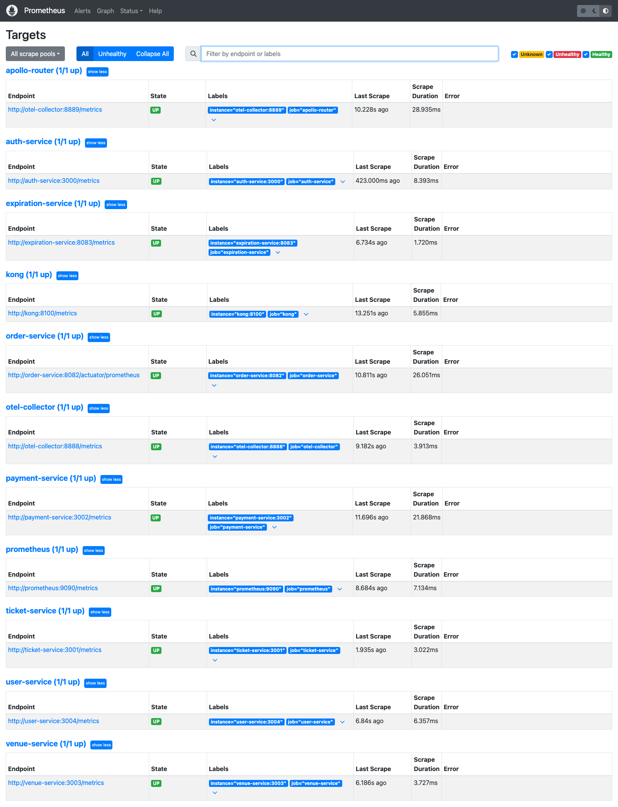
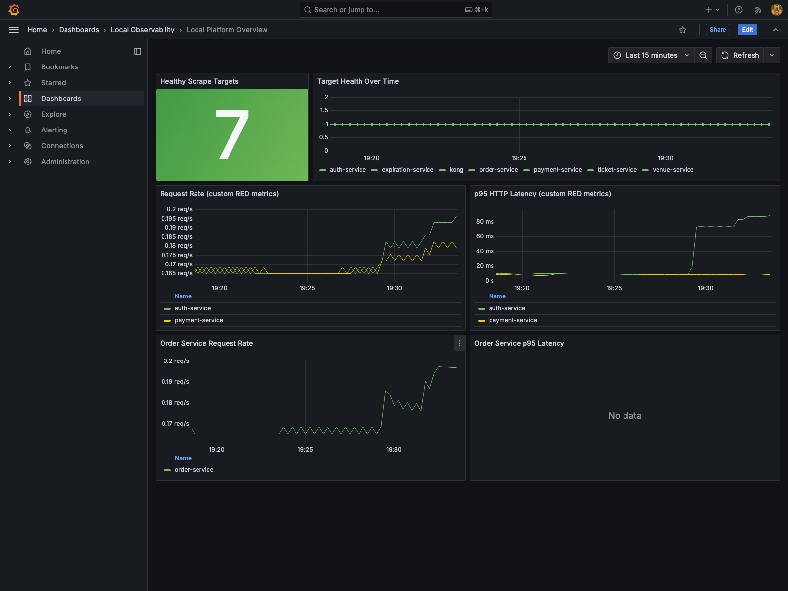
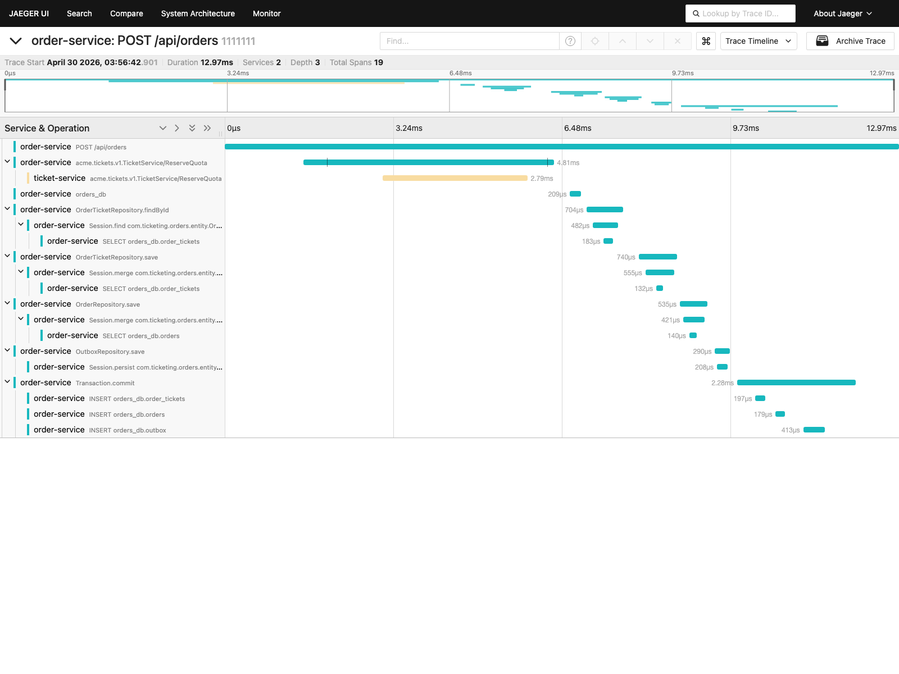
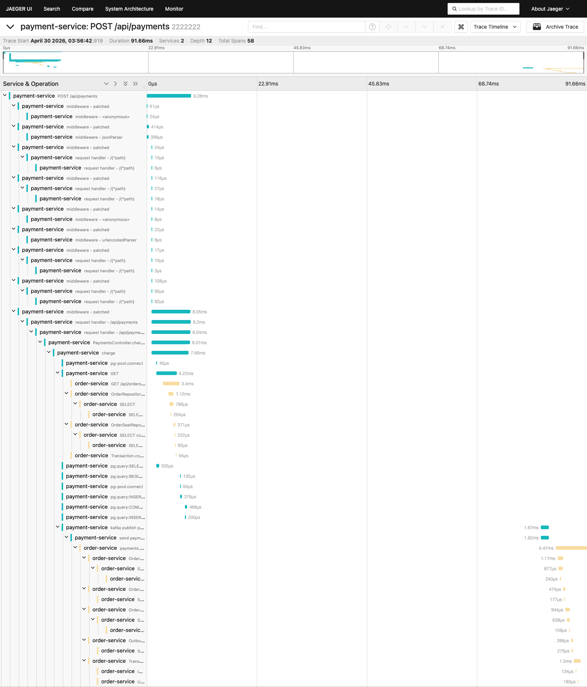

# End-to-End Observability Report

Generated: 2026-04-29T19:57:10.851Z

## Outcome

- Result: PASS
- Flow: seller signup -> ticket create -> buyer signup -> order create -> payment submit -> order complete
- Final order status: complete
- Payment status: completed

## Trace Verification

### Order Trace

- Trace ID: 11111111111111111111111169f2627a
- Services observed: order-service, ticket-service
- Key operations: INSERT orders_db.order_tickets, INSERT orders_db.orders, INSERT orders_db.outbox, OrderRepository.save, OrderTicketRepository.findById, OrderTicketRepository.save, OutboxRepository.save, POST /api/orders, SELECT orders_db.order_tickets, SELECT orders_db.orders, Session.find com.ticketing.orders.entity.OrderTicket, Session.merge com.ticketing.orders.entity.Order

### Payment Trace

- Trace ID: 22222222222222222222222269f2627a
- Services observed: payment-service, order-service
- Key operations: GET, GET /api/orders/{id}, INSERT orders_db.outbox, OrderRepository.findByIdWithTicket, OrderRepository.save, OrderSeatRepository.findAllByOrderId, OutboxRepository.save, POST /api/payments, PaymentsController.charge, SELECT, SELECT com.ticketing.orders.entity.OrderSeat, SELECT orders_db, SELECT orders_db.order_seats, Session.merge com.ticketing.orders.entity.Order

### Async Propagation

- Verified: yes
- Evidence: kafka publish payments.payment.captured, payments.payment.captured process, send payments.payment.captured

## Prometheus Targets

| Job | Health | Scrape URL |
| --- | --- | --- |
| apollo-router | up | http://otel-collector:8889/metrics |
| auth-service | up | http://auth-service:3000/metrics |
| expiration-service | up | http://expiration-service:8083/metrics |
| kong | up | http://kong:8100/metrics |
| order-service | up | http://order-service:8082/actuator/prometheus |
| otel-collector | up | http://otel-collector:8888/metrics |
| payment-service | up | http://payment-service:3002/metrics |
| prometheus | up | http://prometheus:9090/metrics |
| ticket-service | up | http://ticket-service:3001/metrics |
| user-service | up | http://user-service:3004/metrics |
| venue-service | up | http://venue-service:3003/metrics |

## Grafana Dashboards

| Dashboard | UID | URL |
| --- | --- | --- |
| Local Platform Overview | local-platform-overview | /d/local-platform-overview/local-platform-overview |
| Services — RED Metrics | services-red | /d/services-red/services-e28094-red-metrics |

## Prometheus Signals

| Signal | Value | Unit |
| --- | --- | --- |
| Payment Create Success Rate | 0.014034989228145769 | reqps |
| Payment Create Failure Rate | 0 | percent |
| Payment Lookup Failures (5m) | 0 | count |
| Payment Lookup Retries (15m) | 0 | count |
| Payment Lookup Circuit Breaker | 0 | state |
| Apollo Router Operations Total | 3 | count |
| Apollo Router Query Planning p95 | 0.0009499999999999999 | seconds |

## Screenshots

### Prometheus Targets

### Grafana Local Platform Overview

### Grafana Services RED

### Jaeger Order Trace

### Jaeger Payment Trace

## Notes

- Grafana was captured from the provisioned `Local Platform Overview` and `Services — RED Metrics` dashboards.
- Jaeger screenshots were captured from direct trace detail pages for the generated trace IDs.
- Prometheus remained healthy for all locally scraped application targets during this run.
- Async backlog, DLQ, retry-exhaustion, and Kafka lag panels remain a known gap because the local stack does not yet emit stable Prometheus metrics for them.

