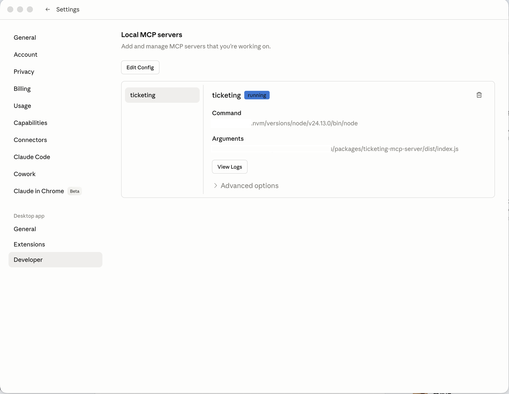
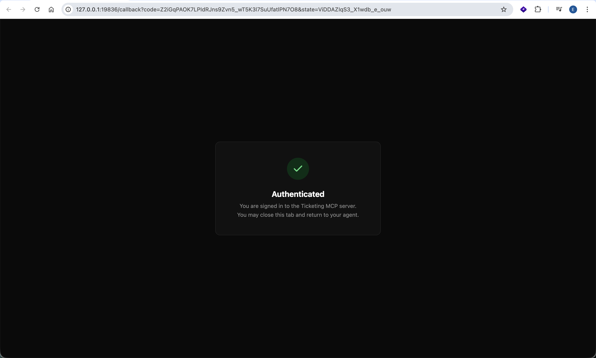
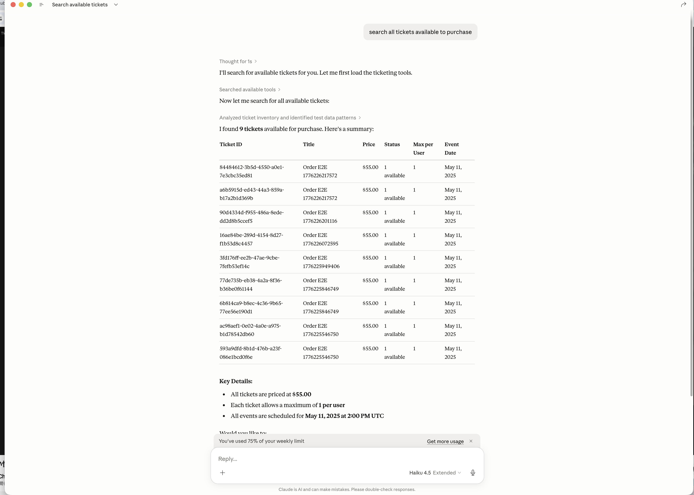
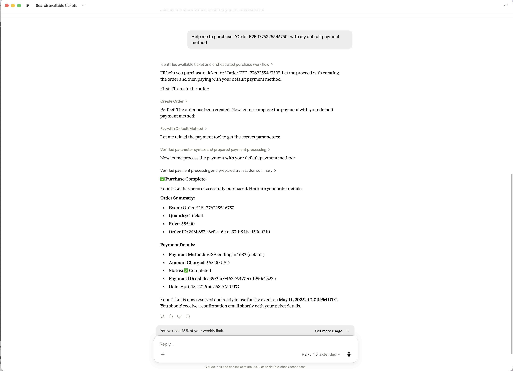
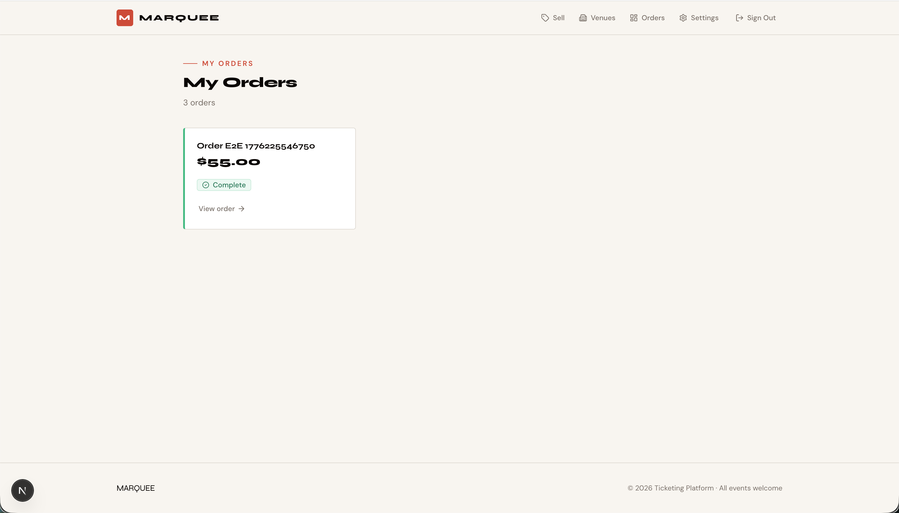
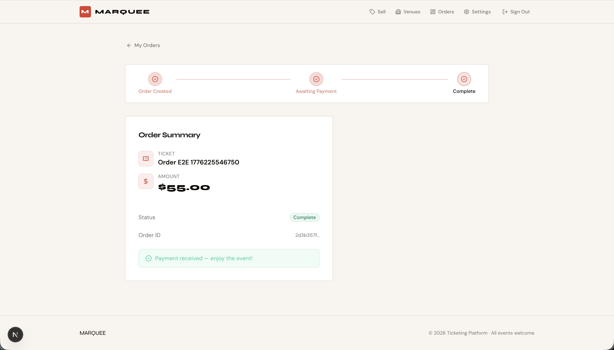

# Ticketing MCP Server

An MCP (Model Context Protocol) server for the ticketing platform that runs locally and exposes AI-agent-friendly tools for searching events, managing orders, and processing payments.

## Features

- OAuth2 Authorization Code with PKCE for secure authentication
- Local token storage in `~/.config/ticketing-mcp/tokens.json` (mode 0o600)
- Automatic token refresh with fallback to re-authentication
- Agent-friendly MCP tools exposed over stdio
- Tool groups:
  - `search_events`, `get_event`
  - `view_seat_availability`
  - `list_my_orders`, `get_order`, `create_order`, `create_seated_order`, `cancel_order`
  - `get_payment`, `pay_for_order`

## Installation

```bash
cd packages/ticketing-mcp-server
pnpm install
pnpm build
```

## Usage

### Environment

- `TICKETING_API_URL` — Base URL for the ticketing API (default: `http://localhost:8000`)

### Run locally

```bash
cd packages/ticketing-mcp-server
export TICKETING_API_URL=http://localhost:8000
pnpm dev
```

### Run the compiled server

```bash
cd packages/ticketing-mcp-server
node dist/index.js
```

### Agent integration

Use the repository-level `.claude/mcp.json` configuration to launch the MCP server from Claude Code or any MCP-compatible agent.

## Authentication

The first time a tool is invoked, the server opens your browser for OAuth2 login and listens for the callback at:

- `http://127.0.0.1:19836/callback`

Authenticated tokens are stored locally at `~/.config/ticketing-mcp/tokens.json` with mode `0o600`.

## Demo Screenshots

The package includes example screenshots showing setup and purchase flows with Claude Code.

- `example/setup.png` — configure the MCP server and connect the agent
- `example/oauth.png` — OAuth authorization flow in the browser
- `example/list_ticket.png` — search/list tickets from the agent
- `example/purchase_with_default.png` — purchase a ticket using default values
- `example/purchase_result_1.png` — successful order confirmation
- `example/purchase_result_2.png` — payment/order details result













## Testing

```bash
cd packages/ticketing-mcp-server
pnpm test
```

Note: the ticketing API should be available at `http://localhost:8000` when running tests or using the MCP tools.

## Package layout

- `src/index.ts` — MCP server startup, tool registration, and stdio transport
- `src/auth/` — OAuth2 PKCE flow, login, refresh handling, and secure token storage
- `src/client/api-client.ts` — HTTP client with Bearer token injection, refresh logic, and retry handling
- `src/tools/` — tool adapters for the ticketing domains
- `.claude/mcp.json` — agent-side configuration for Claude Code and MCP-compatible clients

## Architecture

### Token management (`src/auth/token-store.ts`)

- `readTokens()` — load tokens from disk
- `writeTokens(tokens)` — save tokens with 0o600 permissions
- `isExpired(tokens)` — check expiry with a 30-second skew
- `clearTokens()` — remove token state

### OAuth flow (`src/auth/oauth-flow.ts`)

- `login(apiBaseUrl)` — perform PKCE Authorization Code flow
  - generate code verifier and challenge
  - open browser at `/oauth/authorize`
  - receive callback on localhost:19836
  - exchange code for access and refresh tokens
- `refreshTokens(apiBaseUrl, refreshToken)` — refresh an expired session

### API client (`src/client/api-client.ts`)

- injects `Authorization: Bearer <token>` on requests
- refreshes tokens automatically on 401 or expiry
- falls back to re-authentication when refresh fails
- exposes `get<T>`, `post<T>`, and `delete<T>` helpers

### MCP tools

- **Events** — `search_events`, `get_event`
- **Seats** — `view_seat_availability`
- **Orders** — `list_my_orders`, `get_order`, `create_order`, `create_seated_order`, `cancel_order`
- **Payments** — `get_payment`, `pay_for_order`

## Development

### Type checking

```bash
cd packages/ticketing-mcp-server
pnpm tsc --noEmit
```

### Build

```bash
cd packages/ticketing-mcp-server
pnpm build
```

Output is written to `dist/`.

## API endpoints

All calls go through `TICKETING_API_URL` with `Authorization: Bearer <token>`.

- `GET /api/tickets`
- `GET /api/tickets/:id`
- `GET /api/seating-plans/:id/availability`
- `GET /api/orders`
- `GET /api/orders/:id`
- `POST /api/orders`
- `POST /api/orders/seated`
- `DELETE /api/orders/:id`
- `GET /api/payments/:id`
- `POST /api/payments`

## License

UNLICENSED
