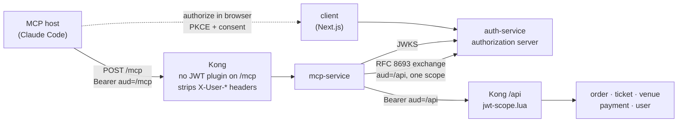
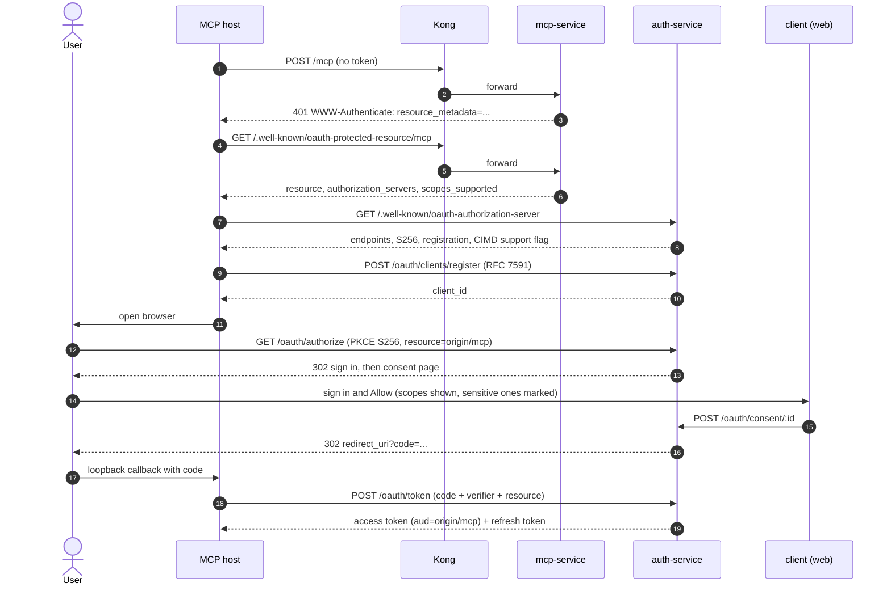
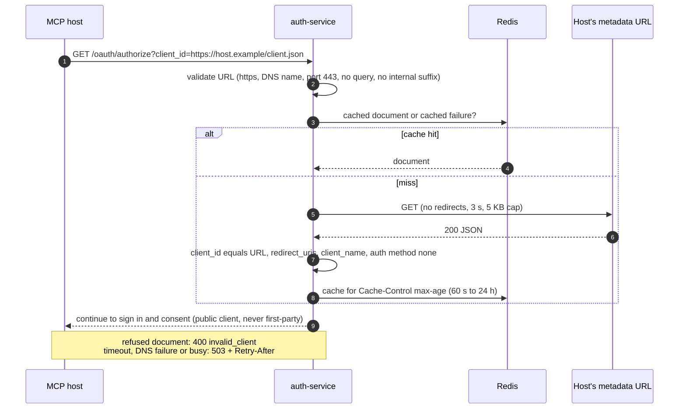
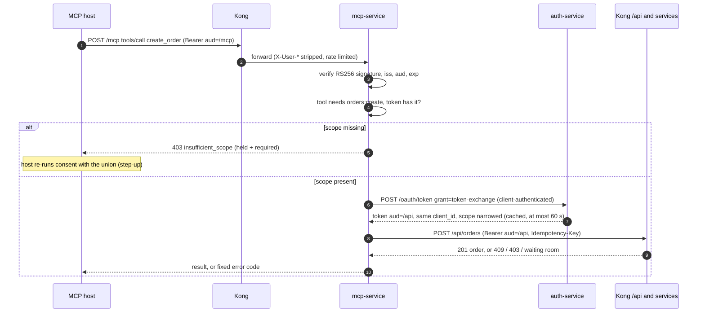

# mcp-service

[Model Context Protocol](https://modelcontextprotocol.io) resource server for the ticketing platform. It lets an MCP host such as Claude Code search events, place and cancel orders and pay on behalf of a signed-in user, over Streamable HTTP at `/mcp`.

The host never sees the user's password. It holds a short-lived OAuth 2.1 token that the user granted on a consent screen and can revoke. mcp-service verifies that token, exchanges it per call for a narrower API token, and calls the public REST API through Kong, so agent traffic is subject to the same scope, waiting-room and rate-limit rules as a browser.

This README is the service overview and data-flow reference. The operator guide (setup, troubleshooting, manual verification) is [`docs/ticketing/mcp.md`](../../docs/ticketing/mcp.md); the threat model is in [`docs/06-security.md`](../../docs/06-security.md). An icon-style version of the auth flows is in [`docs/diagrams/09-mcp-auth-flows.svg`](../../docs/diagrams/09-mcp-auth-flows.svg).

## Responsibilities

- Serve twelve ticketing tools over stateless MCP Streamable HTTP (`POST /mcp`)
- Act as an OAuth 2.1 **resource server**: answer unauthenticated calls with a `401` challenge and publish protected-resource metadata (RFC 9728)
- Verify the host's access token (RS256 via auth-service JWKS, `iss`, `aud=<origin>/mcp`, `exp`)
- Exchange that token (RFC 8693) for a short-lived API-audience token scoped to the one scope the tool needs; never forward the host's token
- Derive idempotency keys so a retried `create_order` does not buy twice
- Map upstream failures to short, fixed error codes (never upstream text, stacks or tokens)
- Own no database and keep no session state

The authorization server (authorize, token, consent, dynamic client registration, Client ID Metadata Documents) lives in **auth-service** (`services/auth-service/src/modules/oauth/`), not here.

## Tech stack

| Concern | Choice |
|---|---|
| Runtime | Node.js 24 LTS |
| Language | TypeScript (ESM) |
| MCP | `@modelcontextprotocol/server` 2.2.0 + `@modelcontextprotocol/node` 2.1.0 (stateless transport) |
| Token verification | `jose` (JWKS) |
| Validation | Zod (config and tool schemas) |
| Logging / tracing | pino, OpenTelemetry (OTLP gRPC) |
| Package manager | pnpm |
| Test runner | Vitest |

## Port

`3000` in the container (`3010` on the host in Docker Compose). Reached publicly only through Kong at `:8000/mcp`.

## Architecture



Three design points explain most of the service:

- **Two audiences.** The host's token is for `<origin>/mcp` and is refused by the REST API (`jwt-scope.lua` rejects any OAuth token whose `aud` is not `<origin>/api`). A stolen MCP token cannot be replayed against the API, and mcp-service never forwards it.
- **Through Kong, not around it.** Tools call the public REST API, so scope checks, the waiting room and per-IP rate limits apply to agents exactly as to browsers.
- **Stateless.** One JSON-RPC request in, one response out. `GET /mcp` and `DELETE /mcp` answer `405` once authenticated; there is no session or server-initiated stream.

## Data flows

### 1. Discovery and authorization (first connection)

The host starts with only the URL. Everything else follows from the `401` challenge. A host that supports Client ID Metadata Documents skips registration (step 4) and uses a URL it hosts as its `client_id`; the CIMD fetch is shown in flow 2.



### 2. Client ID Metadata Document (CIMD)

Only when `OAUTH_CIMD_ENABLED=true` (local Compose and `values-local` only). auth-service fetches the document at the start of authorization, so every check below runs before a user sees a consent screen.



The consent page shows the document's host and where the user is sent after allowing, with a caution if the two differ. Details and limits: [`docs/ticketing/mcp.md`](../../docs/ticketing/mcp.md#client-id-metadata-documents-cimd).

### 3. Authenticated tool call



What this flow guarantees:

- Each exchange re-checks the subject token, so revoking an app stops new exchanges immediately and cuts off an already-exchanged token within 60 s.
- `create_order` sends `Idempotency-Key = sha256(sub, tool, canonical arguments, 15-minute window)`. An identical retry returns the same order with `replayed: true`.
- If the event is behind the waiting room the tool fails with `WAITING_ROOM_ACTIVE` and returns the browser URL; an agent cannot skip the queue.
- Cancel and pay tools carry the MCP `destructiveHint`, so a host may ask the user before calling them.

## Tools and scopes

| Tool | Scope(s) |
|---|---|
| `search_events`, `get_event` | `tickets:read` |
| `view_seat_availability` | `seating:read` |
| `list_my_orders`, `get_order` | `orders:read` |
| `create_order`, `create_seated_order` | `orders:create` |
| `cancel_order` | `orders:cancel` |
| `get_payment`, `list_payment_methods` | `payments:read` |
| `pay_for_order` | `payments:create` |
| `pay_for_order_with_default` | `payments:create` + `payments:read` |

The first `401` challenge asks only for the read scopes; write scopes are requested when a tool needs them. The registry is `src/scopes.ts` and `src/tools.ts`.

## Endpoints

| Route | Auth | Description |
|---|---|---|
| `POST /mcp` | Bearer token, `aud=<origin>/mcp` | JSON-RPC: `initialize`, `tools/list`, `tools/call` |
| `GET /mcp`, `DELETE /mcp` | Bearer token | `405` (stateless); `401` without a token |
| `GET /.well-known/oauth-protected-resource/mcp` | None | RFC 9728 metadata naming the authorization server |
| `GET /health` | None | Liveness and readiness (`{"status":"ok"}`), container healthcheck |

## Environment variables

Validated at startup; the process exits naming every invalid variable (never the values).

| Variable | Required | Description |
|---|---|---|
| `PORT` | No | HTTP port (default: `3000`) |
| `LOG_LEVEL` | No | pino level (default: `info`) |
| `MCP_RESOURCE` | Yes | Public URL of `/mcp`; the required `aud` of every token |
| `API_AUDIENCE` | No | Audience of the exchanged token; must equal auth-service `OAUTH_API_AUDIENCE`. Derived from `MCP_RESOURCE` as `<origin>/api` when unset |
| `OAUTH_ISSUER` | Yes | Authorization server issuer; the required `iss` |
| `AUTH_JWKS_URL` | Yes | In-cluster JWKS endpoint for signature verification |
| `KONG_INTERNAL_URL` | Yes | Kong base URL for upstream REST calls |
| `TOKEN_EXCHANGE_URL` | Yes | auth-service `/oauth/token` endpoint |
| `TOKEN_EXCHANGE_CLIENT_ID` | No | Client id for the exchange (default: `mcp-service`) |
| `TOKEN_EXCHANGE_CLIENT_SECRET` | Yes | Client secret for the exchange. Compose reads `MCP_TOKEN_EXCHANGE_CLIENT_SECRET` from the git-ignored root `.env` |
| `PUBLIC_WEB_URL` | Yes | Web app origin, used to build the browser hand-off link (`/tickets/<id>`) returned when a purchase must finish in the browser |

OpenTelemetry is configured with the standard `OTEL_EXPORTER_OTLP_ENDPOINT` and `OTEL_SERVICE_NAME`.

## Running locally

The service is opt-in in Docker Compose (profile `mcp`) because it refuses to start without the exchange secret.

```bash
# 1. Add MCP_TOKEN_EXCHANGE_CLIENT_SECRET (and the auth-service side of it) to the root .env
#    See docs/ticketing/mcp.md, "Local setup"

# 2. Start the stack with the MCP profile
docker compose --profile mcp up -d --build

# 3. Connect Claude Code
claude mcp add --transport http ticketing http://localhost:8000/mcp
```

To run the process on the host instead:

```bash
cd services/mcp-service
pnpm install
pnpm build && pnpm start      # needs the environment variables above
```

## Testing

```bash
pnpm test         # Vitest, in-process (no Docker)
pnpm typecheck
pnpm lint
```

The full browser-to-tool flow (discovery, consent, token, exchange, idempotent order, both `405`s, CIMD refusals) is covered by `services/client/tests/e2e/mcp-full-flow.spec.ts` against the Compose stack.

## Deployment

Helm sub-chart: `infra/helm/charts/mcp-service/` (Deployment, HPA, PDB, NetworkPolicy, ExternalSecret for the exchange secret, Linkerd HTTP policy). Kong routes are in `services/kong-gateway/config/kong.base.yml`. Running with `OAUTH_CIMD_ENABLED` outside local needs an owner-approved egress rule on auth-service first; see the operator guide.
